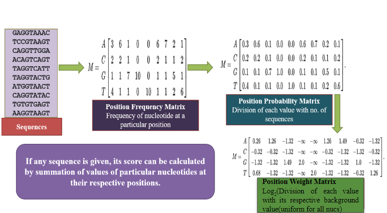

# Position Weight Matrix

> This Project is aimed at developing Object Orineted Programming for Position Weight Matrix (PWM) using Python. This repository contains two scripts. First script can generate the Position Frequency Matrix, Position Probability Matrix and the Position Weight Matrix. The second script uses Biopython module to generate the above three. Additionally, pseudocounts can be used if required and scores for each sequence is obtained from the matrix generated from the given set of input sequences.
>
> A position weight matrix (PWM), also known as a position-specific weight matrix (PSWM) or position-specific scoring matrix (PSSM), is a commonly used representation of motifs (patterns) in biological sequences.
>
> PWMs are often derived from a set of aligned sequences that are thought to be functionally related and have become an important part of many software tools for computational motif discovery.
> For more details on PWM and its calculations, Please refer to [Position Weight Matrix](https://en.wikipedia.org/wiki/Position_weight_matrix)  

## Logical Calculation of PWM
> The Flowchart below depicts how the PWM is calculated.

## Requiremnets
> The following are the required packages and can be installed using the command *"pip install <package_name>"*
###### Package:package_name
- BioPython:Bio
- Numpy:numpy
- Pandas:pandas

## How to run the script?
### To Obtain Position Weight Matrix:
- The input to be given for the script *"PositionWeightMatrix.py"* is a list of sequences with uniform length and can be given as input while creating an instance.
- Please refer to creating instance and Object Instance Sections in the script for modifications of input and instances.
- Then, run the script using "python PositionWeightMatrix.py"

### To Obtain PWM Score for each sequence from Matrix:
- The input for the script *"PWM_Score.py"* is a file with sequences of uniform length. Therefore, the infile and the outfile path have to be updated in the script.
- Example Input file "exampleseqs.txt" is provided in this repository for reference. 
- The pseudocouts if any, can be modified in this script. This script uses BioPython Package.
- Then, run the script using "python PWM_Score.py"  

## Results 
- The script *"PositionWeightMatrix.py"* can generate PFM, PPM AND PWM using methods .getPFM(), .getPPM() and .getPWM() respectively.
- The script *"PWM_Score.py"* gives an output file "exampleseqsscore.txt" with a PWM score generated for each sequence based on the PWM Matrix.